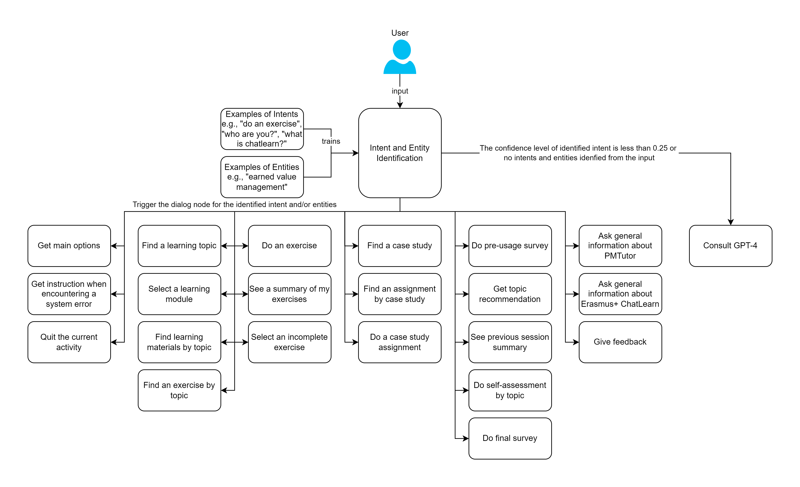

# Erasmus+ ChatLearn PMTutor watsonx assistant configurations
This repository shares practical information and the configuration json files for setting up an instance of PMTutor 
watsonx assistant, which is the core component of PMTutor system.

The diagram below depicts the use cases of PMTutor facilitated by the configurations and other required components 
and services.

Consult [Setup Guide](./setup/setup-guide.md#instructions-for-creating-a-pmtutor-watsonx-assistant) for detailed instructions 
on creating your PMTutor watsonx assistant using the configuration files in this repository.

Check out [Development Guide](./development/development.md#development-guide) for practical information on developing 
your PMTutor watsonx assistant.

## License
MIT
