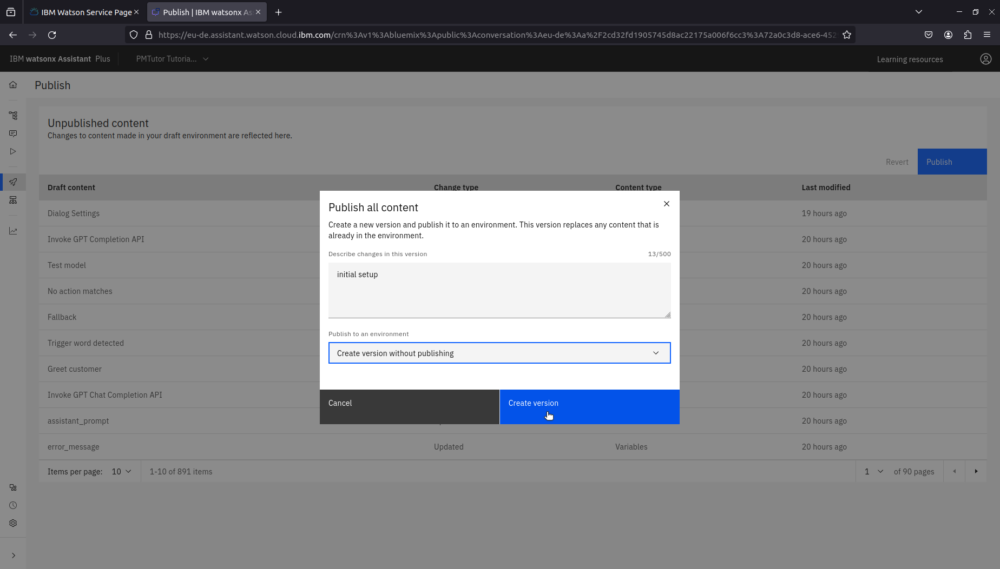
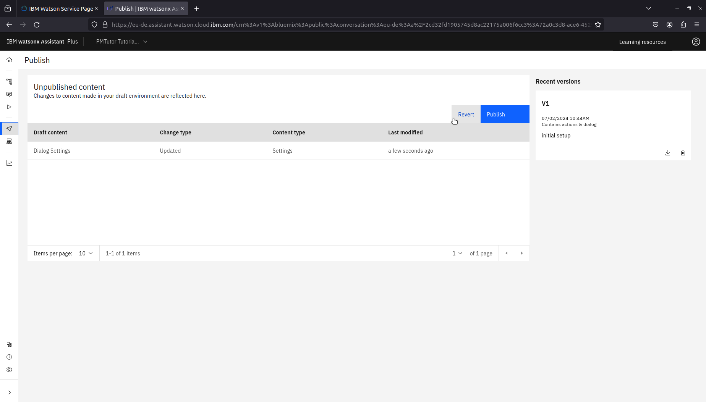
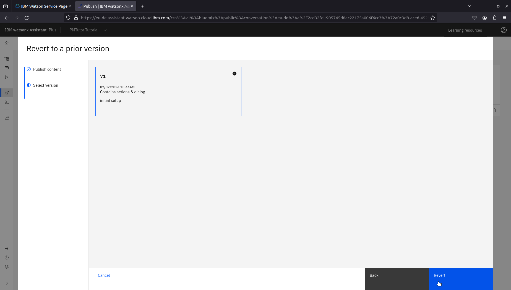
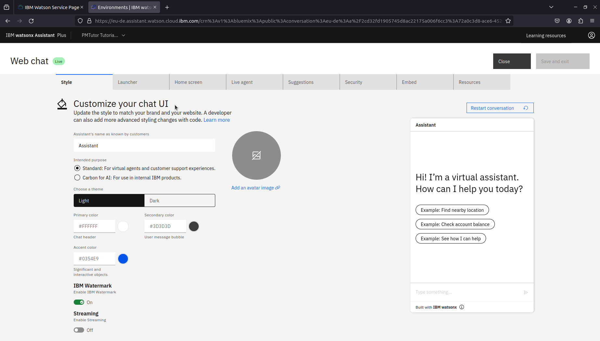

# Development guide
This document serves as a starting point for development. It highlights needed preparation and processes, 
and shares links to essential documentations offered by the service provider.

## Preparation
### Familiarize with dialog skill
The dialog view was the environment where the development of PMTutor watsonx assistant took place during the project. 
Changes could be immediately reviewed and tested using "Try it out" feature.

To develop PMTutor watsonx assistant, it is recommended to familiarize with
[dialog skill](https://cloud.ibm.com/docs/watson-assistant?topic=watson-assistant-skill-dialog-add).

### Familiarize with watsonx assistant version control
Watsonx assistant service offers version control through publishing new versions. This feature enables development in Draft 
environment while serving the users in Live environment with a published version. For development, the feature enables the
developer to save the work-in-progress changes regularly and return to a saved version when needed. Depending on your plan, 
there is a quota for how many versions could be created&mdash;you can download older versions and then delete them to have 
room for new versions. Below shows 3 common scenarios facilitated by this feature.

#### Scenario 1: Save changes in a new version without publishing them

*Hover over the sidebar menu and click on Publish*

*Click on Publish button in the Publish view*

*Select "Create version without publishing" in Publish to an environment*

*A new version is created*

#### Scenario 2: Discard changes and return to a saved version in Draft environment
If you want to discard the changes in Draft, you can do it by returning to a saved version.

Hover over the sidebar menu and click on Publish to navigate to the publish view.

*You can see the changes you made and the version(s) you've saved. Click Revert.*

*Click Next*

*Select a version which you want to revert to by clicking on the version block*

*Click Revert*

*After reverting, you will see the changes made in the selected version instead*

#### Scenario 3: Serve a published version in Live environment
Live environment is intended for production. You can select a published version to be served in this environment.

Navigate to Environments view by hovering over the sidebar menu and clicking on Environments. Then click on Live tab.

*Click on Publish version or Switch version (if a version has been served in this environment already)*

*Select a version for this environment*

*Click on Publish version*

*You will see the selected version is served in this environment*

## Development
### Design
#### Identify use cases
One way to design the dialog skill is by use case. It requires first identifying and analyzing use cases from the 
requirements. For example, fetching learning materials by topic and doing an exercise were identified as two separate 
use cases in the project.

#### Use flowcharts and other visualizations for design
Before modifying the dialog skill, it would be effective to design the dialog flow using flowcharts. The flowcharts could
help stakeholders understand, co-design, verify, or validate the anticipated dialog flow.

#### Create early demo for a major use case
A major use case could require additional development in databases and other web services, in addition to modifying the
dialog skill. Early demo by only modifying the dialog skill could help verify the requirements effectively.

By using [the version control feature](#familiarize-with-watsonx-assistant-version-control), you could create needed 
dialog nodes and intents with minimal samples for the use case in Draft environment, using context variables to mock the
anticipated values from webhook requests.

### Implementation
The implementation of a major use case often took several iterations during the project. It started with a initial 
demo version facilitating the main interactions in the use case. The subsequent iterations include making changes based on 
feedback, refactoring, adding new intents or dialog nodes for serving additional scenarios in the use case, e.g., handling
the scenario when the user wants to quit an exercise.

### Testing
We had used the following methods:
- Verify the changes immediately using [Try it out](#familiarize-with-dialog-skill)
- For integration tests or heuristic evaluations, use webchat integration in [a local or an online dev UI](https://github.com/erasmus-chatlearn/pmtutor-react-ui)

### Deployment: Webchat integration
Users interact with PMTutor through a web application using webchat integration. Watsonx assistant service provides ready
script to be included in a html file. The script will render a chat icon in your html and open a chat box after the user clicks on it.

You can find webchat script from Environment view.

*In Live or Draft environment, you can navigate to web chat settings by clicking on Web chat below Channels*

*In Web Chat view you can customize the chat UI styles*

*Click on Embed tab, you can find the script which could be copied and pasted to your html file*

Please consult [Web Chat documentation](https://web-chat.global.assistant.watson.cloud.ibm.com/docs.html?to=api-configuration) for further information.

For integrating PMTutor watsonx assistant in your REACT application, you can consider using a [React Web Chat SDK](https://github.com/watson-developer-cloud/assistant-web-chat-react).

