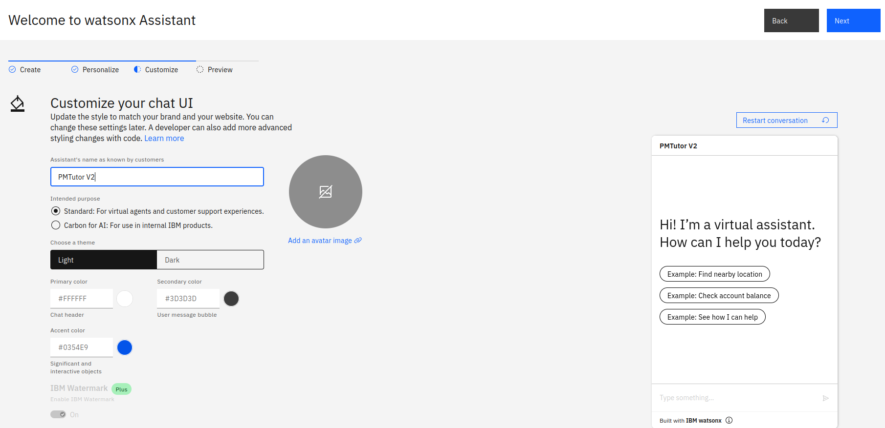
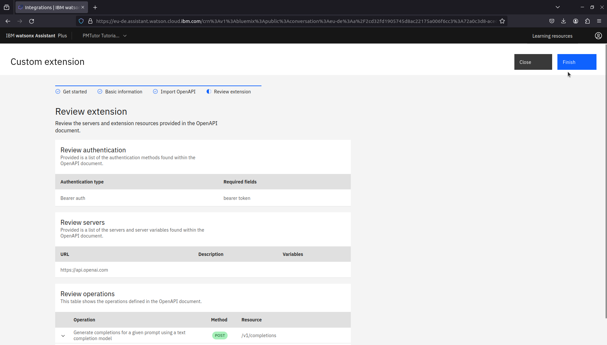

# Instructions for creating a PMTutor watsonx Assistant
This file provides you with detailed step-by-step instructions to help you create your PMTutor watsonx Assistant. 
Please make sure the prerequisites are met before proceeding the setup.

## Prerequisites
* PMTutor databases (Instructions coming soon!)
* PMTutor webhook instance: You can find the source code at [pmtutor-webhook](https://github.com/erasmus-chatlearn/pmtutor-webhook)
* IBM watsonx Assistant Plus
* IBM IAM user with Operator and Manager access rights to the watsonx service 
* OpenAI API key

## Step 1: Create a new watsonx Assistant
If you have not created any watsonx Assistant before in your IBM subscription, 
the watsonx Assistant view will guide you through creating your first assistant.

*The welcome view for creating your first watsonx Assistant*

*Provide required information for personalization&mdash;you can update your settings later*

*You can upload an avatar set the UI styles for your assistant*

*Click "Create" button to complete the steps*

*You should see your assistant view after it has been successfully created*

### Creating another watsonx Assistant
You might want to create another assistant later for different purposes. The steps for creating another one is simpler.

You can find the option "Create New +" from the dropdown list in the top menu bar, when
you click on the name of the current assistant.

*Find "Create New +" option from the top menu bar*

*Fill up the required fields and click on "Create assistant"*

## Step 2: Activate dialog
The screenshots below show how to navigate to Assistant settings to activate dialog.

*Assistant settings is located in the bottom of the side bar menu*

*Click on Activate dialog*

*Click on another Activate dialog button to confirm the activation"*

## Step 3: Upload dialog skill
Navigate to Dialog view by hovering over the sidebar menu and clicking on Dialog.

*Click on Upload / Download in Options*

Upload configurations/pm-tutor-v2-dialog-v44.json.

*Click "Upload" button*

*Confirm uploading*

## Step 4: Configure webhook settings
The webhook URL is removed from the dialog skill json in this repository. Please use the URL of your webhook instance.

You can find webhook settings from Options in Dialog view.

*Provide the URL of your webhook*

## Step 5: Upload action skill
Navigate to Actions view by hovering over the sidebar menu and clicking on Actions. The screenshots below show the rest
of steps for uploading action skill.

*Go to Global settings by clicking on the gear icon in the top-right corner*

*Click on Upload/Download from the tabs under the heading Global settings*

*Upload configurations/pm-tutor-v2-action-v44.json using the Upload section*

*Confirm action skill uploading*

## Step 6: Create and add OpenAI extension
The screenshots below show how to create and add OpenAI extension to your assistant.

*Hover over the sidebar menu and select Integrations*

*Go to Extensions section and click "Build custom extension"*

*Click Next*

*Provide a name of your extension*

*Select and upload configurations/openai-openapi.json*

*Click Finish*

After successfully creating the extension, you should see the name of your extension in the Extensions section.
Click Add to integrate it to your Draft environment.

*Click Add again to confirm the integration*

### Configure custom extension for an assistant environment

*Click Next*

*Copy and paste your OpenAI Platform API key to Token field*

*Click Finish*

After successfully integrating to your Draft environment, you should see your OpenAI platform extension in 
Environments > Draft.

You should also integrate the extension to the Live environment by clicking on Live tab in Environments and then "Add" 
in the OpenAI extension.

It will walk you through the previous steps in [configure custom extension](#configure-custom-extension-for-an-assistant-environment).

